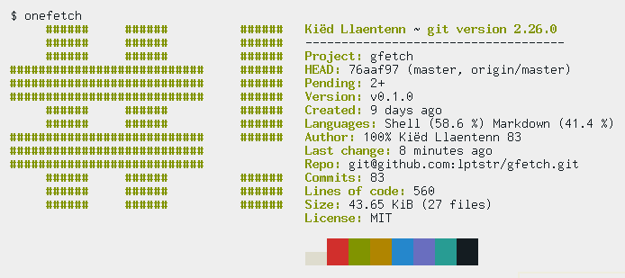
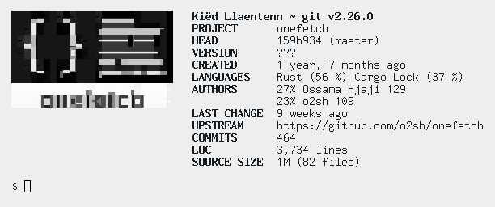

# onefetch vs gfetch

> NOTE: if you think any comparison here is unfair in the least to Onefetch,
> submit an issue and I will remove it.

## design

It's probably only me, but when I first started using Onefetch, I began to feel
as if Onefetch was designed only for pretty screenshots. Huge ASCII art that
can't be disabled, a strange license field, a *colorblocks* field (how on earth
does the terminal's colorscheme relate to Git), written in Rust, slow for large
projects.

Again, it's probably only me, but I don't really like the fact that it's written
in Rust. I've worked on a fetch tool in Rust myself [1](#f1),
and I've come to the conclusion that Rust is *probably* not the best tool for a
fetch program. Shell is a great language for a fetch tool, because all a fetch
tool really does is extract text from commands and various files. And the fact
that they're all in a hundred different formats doesn't matter either, because
you can easily utilize `awk` and `sed` to massage it into the format you want.

Onefetch solves the problem of text extraction by using various libraries (e.g.
the `git2` crate) instead of running commands. [2](#f2)
Again, probably only me, but I don't like that either. I like to see what
commands my fetch tool is running, if only for the education.

On the other hand, `gfetch` was designed for fetching information. I don't want
you to wait while the you fetches all the information before printing
it, I want it now! Start showing me the info now! And when you do, I don't want
a huge 40-column ASCII art with the logo of the language I'm using. I already
know what language it's written in, and even if I didn't, the `Language` field
is quite enough. And BTW, let me display my *own* info fields when I want to.
The default ASCII can be ugly, I don't care, because I want to see the info,
not the art.

#### *This document is a work in progress.*

1. <small id="f1"> See [rsfetch](https://github.com/rsfetch/rsfetch) </small>
[↩](#a1)
2. <small id="f2"> Note, I only did a very cursory examination of the Onefetch
source, so I'm probably a bit off there. </small> [↩](#a2)
