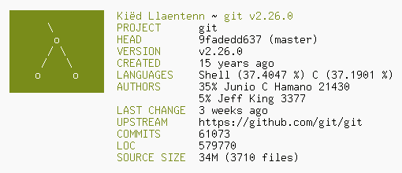

# gfetch

> A command-line Git fetch script.

## what?

`gfetch` is a tiny, lightweight shell script that can be used as an alternative
to `onefetch`.

`gfetch` is

- **small**. the entire script is less than 300 lines of code (not counting
comments).
- **fast**. fine, not by a large margin, but still a few milliseconds faster :)
- **POSIX**: runs on just about any modern POSIX shell: `bash`, `dash`, `mksh`,
`loksh`, anything short of `tcsh` or `mksh`.
- **less distracting**. `gfetch` does not have and never will have
huge, ridiculous ASCII art that takes up half the screen.
- **configurable**. This fetch script was designed from the ground up to be
completely configurable, down to the order of the information fields. Every
single field -- even the (small) ASCII art -- can be disabled.

## where?

You will need:

- a Unix-like system (Windows support is planned)
- a fairly modern version of Git (duh)
- a POSIX-compliant shell. (so no fish, tcsh, etc)
- GNU sed and GNU awk (other sed/awk implementations *might* work, but are
untested.)
- GNU Make (the Makefile is incompatible with `bmake`)
- SCC (optional, only required for language detection and LOC count)

Then, simply grab a release tarball from the GitHub releases, extract, and run:

```
$ make clean all
# make install
```

**NOTE:** Make will install to `/usr/local/bin` by default, so ensure that that
directory is in your path first. If you want to install to a different
location (e.g. `/usr/bin`) you can run `make PREFIX=/usr install` instead.

## how?

Ensure that the `gfe` script is in your path, then execute it. You should get
something like:



**Configuration** is done by editing the shell script at
`~/.config/gfe/config.sh`, which is created by default if it doesn't exist.
