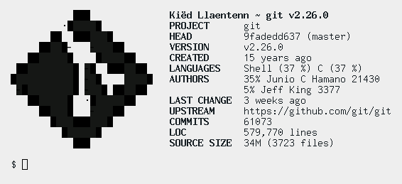

<h1 align=center>gfetch</h1>
<p align=center><b><a href="#what">what?</a> | <a href="#where">where?</a> | <a href="#how">how?</a> | <a href="#why">why?</a> | <a href="#faq">faq</a> | <a href="#license">license</a></b></p>
<hr>
<p align="center">
<a href="./COPYING"></a>
<a href="https://github.com/lptstr/gfetch/releases"></a>
</p>



`gfetch` is a tiny, lightweight shell script that can be used as an alternative
to `onefetch`.

## what?

`gfetch` is

- **small**: the entire script is less than 300 lines of code (not counting
comments).
- **fast**: shows information for the `git` repository in just a few seconds.
- **POSIX**: runs on just about any modern POSIX shell: `bash`, `dash`, `mksh`,
`loksh`, anything short of `tcsh` or `mksh`.
- **less distracting**. `gfetch` does not have and never will have
huge, ridiculous ASCII art that takes up half the screen.
- **configurable**. This fetch script was designed from the ground up to be
completely configurable, down to the order of the information fields. Every
single field -- even the (small) ASCII art -- can be disabled.

Note that `gfetch` is still in very early stages. Expect bugs, incorrect
information, and lots of missing features.

## where?

You will need:

- a Unix-like system (Windows support is planned)
- a fairly modern version of Git (duh)
- a POSIX-compliant shell. (so no fish, tcsh, etc)
- GNU sed and GNU awk (other sed/awk implementations *might* work, but are
untested.)
- GNU Make (the Makefile is incompatible with `bmake`)
- SCC (optional, only required for language detection and LOC count)

Then, simply grab a release tarball from the GitHub releases, extract, and run:

```
$ make clean all
# make install
```

directory is in your path first. If you want to install to a different
location (e.g. `/usr/bin`) you can run `make PREFIX=/usr install` instead.

## how?

Ensure that the `gfe` script is in your path, then execute it.

**Configuration** is done by editing the shell script at
`~/.config/gfe/config.sh`, which is created by default if it doesn't exist.
It is then `source`d by `gfe` on startup.

The configuration file consists of some environment variable definitions,
which are only set if they are empty. This allows them to be overridden at
runtime.

The list of environment variables is as follows:

```
# ensure that you use the
# form GFE_VALUE=\${GFE_VALUE:-othervalue}
# to ensure that it can be overridden on
# the command line!!
#
# GFE_LOGO: path to file with ASCII art.
# if it\'s value is not a valid file, then
# it is treated as ASCII art itself.
GFE_LOGO=\"\${GFE_LOGO:-}\"

# GFE_ALIGN: number of spaces for padding between
# name and info columnds
GFE_ALIGN=\"\${GFE_ALIGN:-13}\"

# GFE_COL1: color for the first column (the
# name column). possible values: 1-7
GFE_COL1=\"\${GFE_COL1:-1}\"

# GFE_COL2: color for the second column (the
# info column). possible values: 1-7
GFE_COL2=\"\${GFE_COL2:-7}\"

# GFE_COL3: color for the header/title.
# possible values: 1-7
GFE_COL3=\"\${GFE_COL3:-1}\"

# GFE_SEP: character or text to separate each name
# and info line.
# e.g. using the value ':' would become 'name: info'
# in output.
GFE_SEP=\"\${GFE_SEP:-}\"

# GFE_DIR: directory/repository for gfetch to cd
# into.
GFE_DIR=\"\${GFE_DIR:-}\"

# GFE_AUTHOR_MAX: maximum number of authors for the
# AUTHORS gfe field.
GFE_AUTHORS_MAX=\"\${GFE_AUTHORS_MAX:-2}\"

# GFE_LANG_MAX: maximum number of languages for the
# LANGUAGES gfe field.
GFE_LANG_MAX=\"\${GFE_LANG_MAX:-2}\"
```

The config file also contains `gfe_info()` function, which is executed
by `gfe` to show the information. It looks something like this:

```
gfe_info() {
    # print a newline.
    printf ''

    # print the default ASCII art.
    # note that the show_ascii() function must be
    # the FIRST if it is used.
    show_ascii

    # print a Onefetch-esque header, with the
    # Git username and Git version.
    # usage: showheader <left> <right> <sep>
    showheader "$(get_user)" "$(get_gitver)" " ~ "

    # Each showinfo call prints one row of info.
    # By default, all available info is printed.
    # each command inside the "$()" is a gfetch
    # function to get information.
    #
    # if you wish, you can even display your own text
    # with the showinfo function.
    # e.g. showinfo "$(hostname)" "HOSTNAME"

    # usage: showinfo <info> <label>
    showinfo "$(get_project_name)" 'PROJECT'

    # note: get_head_long() shows the branch name
    # as well as latest commit. if you want to see
    # only the latest commit, you can use the
    # get_head() function instead.
    showinfo "$(get_head_long)"    'HEAD'

    showinfo "$(get_version)"      'VERSION'
    showinfo "$(get_created)"      'CREATED'
    showinfo "$(get_languages)"    'LANGUAGES'
    showinfo "$(get_authors)"      'AUTHORS'
    showinfo "$(get_latest)"       'LAST CHANGE'
    showinfo "$(get_upstream)"     'UPSTREAM'
    showinfo "$(get_commit_count)" 'COMMITS'
    showinfo "$(get_loc)"          'LOC'
    showinfo "$(get_srcsize)"      'SOURCE SIZE'

    # print a newline.
    printf ''
}
```

By default, all available information is printed.

## why?

See [ONEFETCH.md](ONEFETCH.md) for a Onefetch vs gfetch comparison.

## faq

- **Q**: Why is a lambda the default ASCII art?
	- **A**: well, it's supposed to be a branch. (you know,
	`git branch`?) If you think you can do better, feel free to submit an
	issue with your ASCII art :)
- **Q**: Are there any plans to add language-specific ASCII art (as in Onefetch)?
	- **A**: Eventually. The goal is to first add other missing info fields
	and further optimize the code.

## license

`gfetch` is licensed under the MIT license. See [COPYING](COPYING) for
more information.
